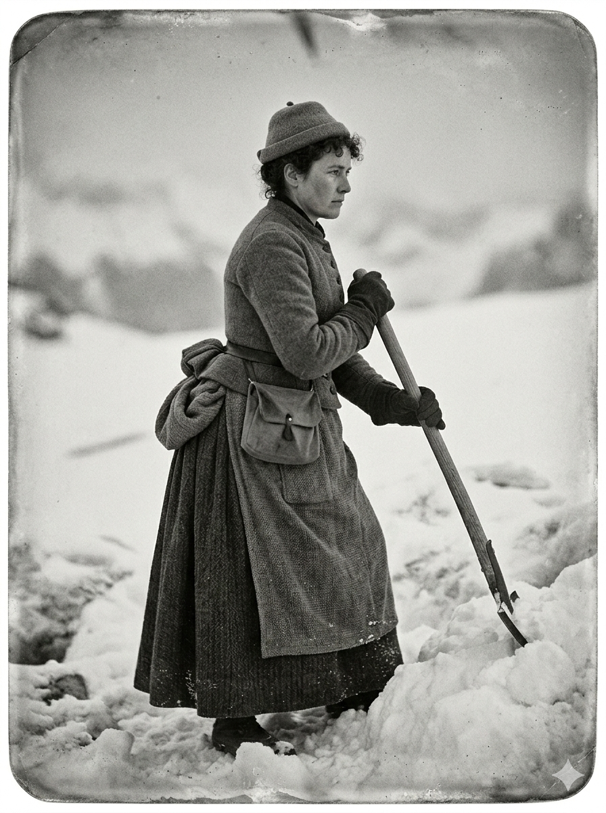

# Carnet d'exploration

## Workshop LoRA

---

# Présentation personnelle / intentions

Dans ce workshop, on travaille autour des logiques de génération d’images par intelligence artificielle, mais surtout autour de la manière dont un univers visuel peut être compris, appris, reproduit, puis transformé par un modèle.

Ce qui m’intéresse dans ce cours, ce n’est pas seulement d’obtenir une “belle image”, mais de comprendre ce que l’outil retient réellement d’un visuel : une matière, une lumière, une forme, un rythme, une manière de cadrer, ou au contraire un mélange trop vague qui rend les résultats instables.

L’objectif du workshop est donc à la fois sensible mais surtout technique. Il s’agit d’apprendre à construire un dataset*, à entraîner un LoRA*, à tester ses limites, à analyser les écarts entre intention et résultat, puis à affiner le processus par itérations successives.

Ce repository documente les différentes étapes de mon apprentissage, depuis les premiers exercices jusqu’à la définition du projet final.

*L'adaptation par modèle auxiliaire (LoRA) **est un moyen d'adapter un grand modèle d'apprentissage automatique à des utilisations spécifiques sans avoir à entraîner de nouveau l'ensemble du modèle**

*Un dataset est une **collection structurée de données, organisées et stockées à des fins d'analyse ou de traitement**. Les données d'un dataset ont généralement des points communs et proviennent d'une même source, ou sont destinées à un même projet.

---

# Contexte du workshop

Le workshop repose sur une progression en plusieurs temps :

1. apprendre à décrire une image de manière suffisamment précise pour qu’une IA puisse tenter de la régénérer ;
2. comprendre le fonctionnement d’un LoRA à travers des exercices ciblés ;
3. expérimenter l’entraînement d’un LoRA sur un object/une personne, puis sur un style ou un univers ;
4. préparer un projet personnel construit à partir d’un univers cohérent ;
5. documenter toutes les étapes du processus, les essais, les erreurs, les ajustements et les itérations.

Le livrable (repository) final n’est donc pas uniquement un résultat visuel, mais aussi la trace complète du cheminement.

---

# Définitions utiles

**Types d’intelligence artificielle**

### IA symbolique

L’IA symbolique est une forme d’intelligence artificielle basée sur des règles logiques écrites à l’avance par des humains. Elle fonctionne en manipulant des symboles (mots, chiffres, signes) et en suivant des instructions précises pour résoudre un problème. Elle ne “comprend” pas le monde : elle applique des règles définies.

Cette approche a dominé les débuts de l’histoire de l’IA. Elle est particulièrement efficace pour des tâches structurées où les règles sont claires.

Exemples :

- **Shakey (fin des années 1960)** : robot développé au Stanford Research Institute, souvent considéré comme l’un des premiers systèmes utilisant l’IA symbolique. Shakey pouvait se déplacer dans un environnement simple, reconnaître certains objets et planifier ses actions en appliquant des règles logiques étape par étape.
- **Deep Blue (1997)** : ordinateur d’échecs d’IBM qui a battu le champion du monde Garry Kasparov. Il ne jouait pas “intuitivement”, mais analysait un très grand nombre de possibilités en appliquant des règles et des calculs.

En résumé : une IA qui suit des règles écrites par des humains.

### IA connexionniste

L’IA connexionniste fonctionne différemment : elle apprend à partir d’exemples au lieu d’appliquer uniquement des règles fixes. Elle s’inspire du fonctionnement du cerveau humain à travers des réseaux de neurones artificiels.

Au lieu d’être programmée pour chaque tâche, elle est entraînée à partir de grandes quantités de données. Elle apprend à reconnaître des formes, des motifs et des relations sans qu’on lui explique explicitement comment faire.

Exemple :

- **Yann LeCun** : figure majeure de l’IA connexionniste. Dans les années 1990, il développe des systèmes capables de reconnaître automatiquement les chiffres manuscrits des codes postaux. Le modèle apprend à partir d’images plutôt qu’à partir de règles écrites.

En résumé : une IA qui apprend à reconnaître des motifs à partir d’exemples.

### IA générative

L’IA générative est une évolution récente des approches connexionnistes. Elle ne se contente plus de reconnaître des informations : elle produit du contenu nouveau.

En étant entraînée sur de grandes quantités de données (textes, images, sons), elle peut générer :

- des images,
- des textes,
- des vidéos,
- des sons,
- des formes visuelles.

Elle ne copie pas directement ce qu’elle a appris : elle combine et transforme ces informations pour produire de nouvelles formes.

Les outils utilisés dans ce workshop (Flux, Gemini, etc.) appartiennent à cette catégorie.

En résumé : une IA qui produit du contenu à partir de ce qu’elle a appris.

## Qu’est-ce qu’un LoRA ?

Un **LoRA** (*Low-Rank Adaptation*) est une méthode d’entraînement léger appliquée à un modèle de génération d’images déjà existant.  
Au lieu de réentraîner un modèle entier, ce qui serait très lourd techniquement, on lui apprend un ensemble plus ciblé de caractéristiques à partir d’un corpus précis.

Un LoRA peut servir à faire apprendre :

- une personne,
- un objet,
- un style visuel,
- une matière,
- un type d’univers,
- une manière de représenter une image.

L’intérêt est qu’on peut ensuite activer ce LoRA pendant la génération pour faire apparaître les caractéristiques apprises dans de nouvelles images.

## Qu’est-ce qu’un trigger word ?

Le **trigger word** est le mot-clé qui permet d’activer ou d’appeler le LoRA dans un prompt.  
C’est une sorte de balise textuelle associée à l’entraînement.

Par exemple :

- `ALN` pour mon LoRA entraîné sur ma propre personne,
- `PTME` pour mon LoRA entraîné sur un univers de pointillisme noir et blanc.

Quand ce mot apparaît dans le prompt, le modèle comprend qu’il doit mobiliser les caractéristiques apprises dans ce LoRA.

# Objectifs pédagogiques du workshop

À travers ce workshop, plusieurs enjeux apparaissent :

- apprendre à observer une image avec précision ;
- comprendre la relation entre texte et image dans les systèmes génératifs ;
- construire un dataset cohérent ;
- identifier ce qu’un modèle comprend ou non ;
- expérimenter le lien entre univers, medium, annotations et résultats ;
- adopter une méthode de travail fondée sur l’itération et l’analyse critique.
  
  

# Exercice 1

## Décrire une image pour tenter de la régénérer

### But de l’exercice

Le premier exercice consistait à partir d’images de base fournies dans un tableau Excel, puis à les décrire le plus précisément possible afin de demander à une IA de les recréer à partir du texte seul.

L’objectif était double :

- apprendre à mieux regarder une image ;
- mesurer l’écart entre une image source et sa régénération à partir d’un prompt détaillé.

**image de référence:**

**prompte:** 

Génère une peinture figurative stylisée représentant une scène calme autour d’une piscine extérieure dans un paysage montagneux verdoyant. La composition est horizontale et équilibrée : la moitié inférieure de l’image est occupée par la piscine, tandis que l’arrière-plan est rempli de végétation et de montagnes.
Au premier plan, une piscine rectangulaire remplie d’une eau claire et bleu vif reflète une lumière douce. La surface de l’eau présente des reflets ondulés stylisés formant des lignes abstraites blanches et légèrement jaunâtres sur le fond du bassin. Un corps humain flotte face contre l’eau, de manière horizontale et détendue. La personne porte un short blanc. Ses bras et ses jambes sont légèrement pliés, et ses cheveux foncés se diffusent doucement dans l’eau. La posture paraît calme et immobile, sans tension visible.
Sur le bord droit de la piscine se tient une autre personne, vue de profil, regardant vers le bas en direction du corps flottant. Il s’agit d’un jeune homme à la peau claire, aux cheveux blonds mi-longs coiffés sur le côté. Il porte une veste rouge corail, une chemise claire en dessous, un pantalon très clair (presque blanc) et des chaussures en cuir marron. Sa posture est légèrement penchée vers l’avant, les bras relâchés le long du corps, exprimant une attitude contemplative et silencieuse. Son ombre s’étire en diagonale sur le sol carrelé.
Le bord de la piscine est entouré d’une margelle beige et d’une terrasse composée de carreaux rectangulaires dans des tons discrets de gris, bleu et beige, disposés en grille régulière.
À l’arrière-plan, une végétation dense encadre la scène : de grands arbres aux formes arrondies à gauche, des arbustes et plantes fleuries rosées vers le centre, ainsi que des arbres élancés de type cyprès dans la distance. Plus loin, des montagnes se superposent en dégradés de bleu, créant une profondeur atmosphérique. Le ciel est pâle et uniforme, sans nuages visibles.
Le style général évoque une peinture contemporaine aux formes simplifiées, aux contours nets et aux textures lisses. La lumière est douce et homogène, suggérant la fin de matinée ou le début d’après-midi. L’ambiance est calme, introspective et légèrement irréelle, avec une impression d’immobilité totale.

**résultat:**

### Outils utilisés

- **Gemini / Nano Banana 2** pour une première tentative de génération à partir de la description

**image de référence:**

**prompte:**

Génère une photographie ancienne en noir et blanc en format portrait, la qualité ne doit pas être parfait, on ne voit pas  trop les traits du visage de la personne représentant une femme debout dans la montagne de neige on dirait presque qu’elle est peinte. L’image a un rendu un très doux et flou typique des photos du XIXe siècle.
La femme est montrée de profil, tournée vers la droite. Elle se tient droite mais dans une posture active, comme si elle était en train de travailler. Elle tient à deux mains un long manche en bois, probablement celui d’une pelle ou d’un outil pour déblayer la neige. Une partie de l’outil est plantée dans un amas de neige devant elle.
Elle porte des vêtements épais adaptés au froid : une longue robe sombre qui descend jusqu’aux chevilles, un tablier noué à l’arrière avec un gros nœud visible, ainsi qu’un manteau ou corsage ajusté. Elle porte aussi des gants foncés et un petit chapeau posé sur le haut de la tête, laissant apparaître ses cheveux bouclés à l’avant. Une petite besace ou un sac est attaché à sa taille.
Son expression est sérieuse et concentrée, avec le regard dirigé vers l’avant. Elle semble calme et déterminée.
Autour d’elle, le sol est entièrement couvert de neige, formant des monticules irréguliers. L’arrière-plan est très simple et neutre, sans décor précis, ce qui met toute l’attention sur la silhouette de la femme et son activité.
L’image dégage une atmosphère sobre, silencieuse et réaliste, avec une impression de dureté liée au froid et au travail physique.

**résultat:**

### Outils utilisés

- **Flux.1 sur Replicate** pour comparer les résultats avec un autre modèle.

### Méthode

À partir de chaque image, il fallait repérer le plus d’éléments possible :

- composition ;
- posture des personnages ;
- vêtements ;
- objets ;
- décor ;
- lumière ;
- matière ;
- style ;
- ambiance ;
- détails secondaires ;
- époque éventuelle ;
- angle de vue ;
- qualité photographique ou picturale.

L’idée n’était pas seulement de nommer ce qui est visible, mais de transformer l’image en langage suffisamment précis pour guider une génération.

### Ce que cet exercice m’a appris

Cet exercice m’a fait comprendre que décrire une image de manière “globale” ne suffit pas car les IA qu'on utilise est souvent "influancé" par des stéréotypes comme le fait que quand il génère une l'image de femme elle est toujours digne d'une top modèle il à du mal à faire un nez crochu ou avec un physique enrobé par exemple

# Exercice 2

## Entraîner un LoRA sur une personne

### Sujet choisi

Pour ce deuxième exercice, j’ai choisi d’entraîner un LoRA sur **ma propre personne**.

J’ai constitué un corpus d’environ vingt images de moi dans :

- différents lieux ;
- différentes postures ;
- différentes expressions ;
- différentes accessoires ;
- différentes lumières.

**dataset:**    [dataset_ALN](SRC_ex1)

### Trigger word

`ALN`

### But de l’exercice

L’objectif était de comprendre comment un modèle apprend l’identité visuelle d’une personne à partir d’un ensemble d’images, puis comment cette identité peut être rappelée dans de nouvelles générations grâce au trigger word.

### Intérêt du choix et observations

J’ai trouvé ce choix intéressant parce qu’il me permettait de voir très vite si le LoRA fonctionnait ou non.  
Comme je connais mon propre visage, mes expressions et mes traits, il m’était plus facile d’identifier :

- ce que le modèle retenait bien ;
- ce qu’il déformait ;
- ce qu’il confondait ( les grains de beauté, car les selfies change leurs positions);
- ce qu’il généralise.

**exemples:**    [Voir le PDF](TEST_ex1.pdf)

# Exercice 3

## Entraîner un LoRA sur un style / un univers

### Sujet choisi

Pour ce troisième exercice, j’ai choisi un **univers de pointillisme noir et blanc**.

**dataset:** [dataset_PTME](SRC_ex2)

### Trigger word

`PTME`

### Intention

Cette fois, il ne s’agissait plus d’apprendre une personne ou un objet, mais une logique visuelle plus large : un style, une texture, une ambiance graphique.

Je voulais voir si le modèle pouvait apprendre une esthétique reconnaissable à partir d’un corpus cohérent.

## Premier test

### Dataset initial

Pour le premier essai, j’ai utilisé **13 images** issues du pointillisme.

### Résultat

Le résultat n’a pas fonctionné, il n'as pas compris.

### Problèmes identifiés

Plusieurs raisons expliquent cet échec :

- la qualité des images n’était pas toujours bonne ;
- certaines images contenaient trop de bruit visuel ;
- les styles étaient trop variés entre eux ;
- le corpus n’était pas assez homogène ;
- le modèle n’arrivait donc pas à identifier une logique claire.

### Analyse

Ce premier test a été très utile, justement parce qu’il n’a pas marché.  
Il m’a montré qu’un style n’est pas seulement une “idée générale”. Pour qu’un LoRA l’apprenne, il faut que les images partagent réellement des caractéristiques répétées :

- même logique graphique ;
- même rapport au noir et blanc ;
- même densité visuelle ;
- même type de contraste ;
- même cohérence de traitement.

## Deuxième test

### Modifications apportées

J’ai reconstruit le dataset en faisant plus attention à la cohérence :

- davantage d’images ;
- uniquement en noir et blanc ;
- meilleure qualité globale ;
- style plus homogène.

### Résultat

Cette seconde version a mieux fonctionné.  
Le LoRA arrivait davantage à reconnaître et réinjecter le langage visuel que je cherchais.

**exemples:** [Voir le PDF](TEST_ex2.pdf)

## Le projet final:

## Narration de l’univers

[Voir la narration complète (PDF)](Projet_univers_texte.pdf)

## Moodboard de l’univers

[Moodboard](Moodboard_with_details.pdf)  
[Link to the Moodboard](https://docs.google.com/spreadsheets/d/1C5wHsOxb5NSeg9QJIfjpQOHnOO8ovJvjfFN-Q9QtR84/edit?usp=sharing) 

## Choix de la ligne directrice

Dans le temps attribué pour ce projet, je choisis de me concentrer sur une seule partie de cet univers afin de la développer de manière plus précise et cohérente. Je ne peux pas traiter l’ensemble du système visuel en si peu de temps, donc je me focalise sur un axe spécifique qui permet d’exprimer clairement l’atmosphère dystopique et les logiques de contrôle de cet environnement.
